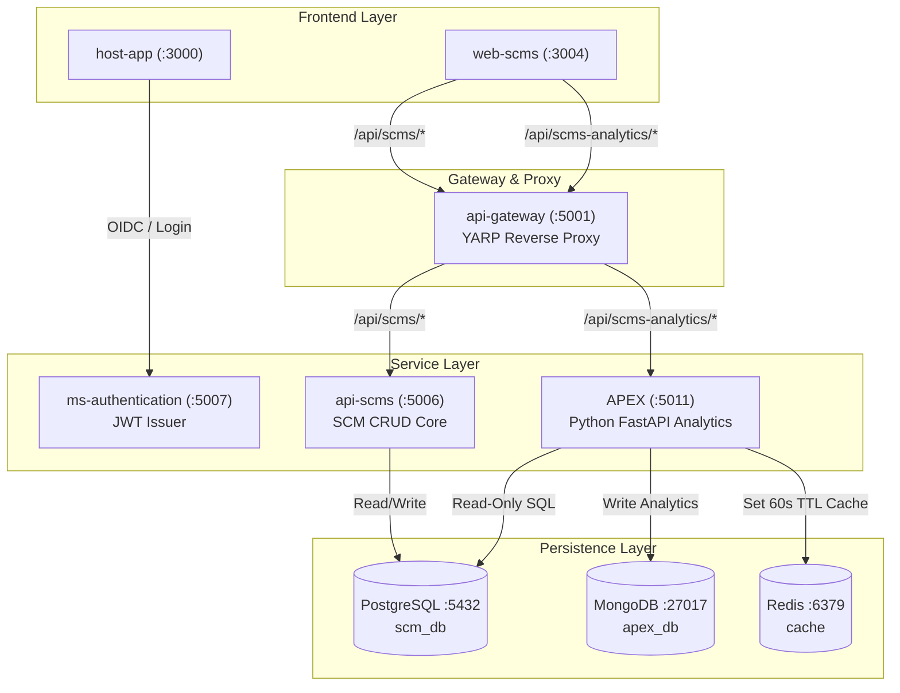
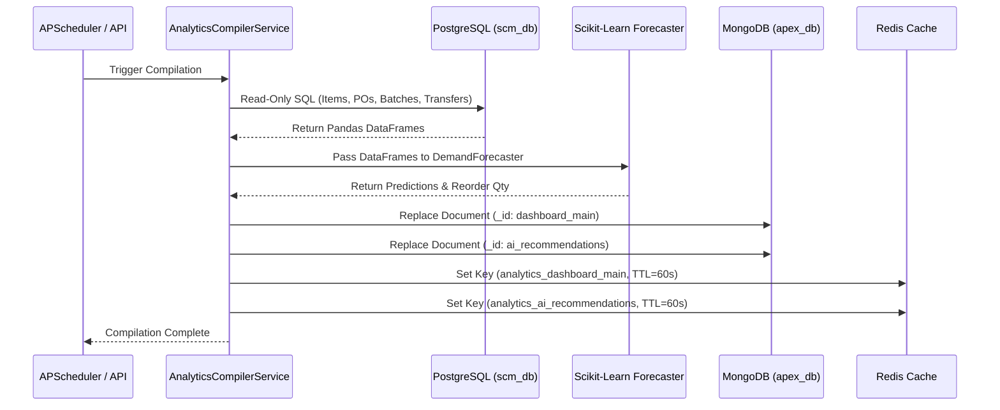

# APEX Architecture & Data Flow Diagrams

## System Overview Diagram

```mermaid
graph TB
    subgraph "Frontend Layer"
        WEB["web-scms (:3004)"]
        HOST["host-app (:3000)"]
    end

    subgraph "Gateway & Proxy"
        GW["api-gateway (:5001)<br/>YARP Reverse Proxy"]
    end

    subgraph "Service Layer"
        AUTH["ms-authentication (:5007)<br/>JWT Issuer"]
        SCM["api-scms (:5006)<br/>SCM CRUD Core"]
        APEX["APEX (:5011)<br/>Python FastAPI Analytics"]
    end

    subgraph "Persistence Layer"
        PG[(PostgreSQL :5432<br/>scm_db)]
        MONGO[(MongoDB :27017<br/>apex_db)]
        REDIS[(Redis :6379<br/>cache)]
    end

    HOST -->|"OIDC / Login"| AUTH
    WEB -->|"/api/scms/*"| GW
    WEB -->|"/api/scms-analytics/*"| GW

    GW -->|"/api/scms/*"| SCM
    GW -->|"/api/scms-analytics/*"| APEX

    SCM -->|"Read/Write"| PG
    APEX -->|"Read-Only SQL"| PG
    APEX -->|"Write Analytics"| MONGO
    APEX -->|"Set 60s TTL Cache"| REDIS
```

## Compilation Pipeline

```mermaid
sequenceDiagram
    participant Scheduler as APScheduler / API
    participant Compiler as AnalyticsCompilerService
    participant PG as PostgreSQL (scm_db)
    participant ML as Scikit-Learn Forecaster
    participant Mongo as MongoDB (apex_db)
    participant Redis as Redis Cache

    Scheduler->>Compiler: Trigger Compilation
    Compiler->>PG: Read-Only SQL (Items, POs, Batches, Transfers)
    PG-->>Compiler: Return Pandas DataFrames
    Compiler->>ML: Pass DataFrames to DemandForecaster
    ML-->>Compiler: Return Predictions & Reorder Qty
    Compiler->>Mongo: Replace Document (_id: dashboard_main)
    Compiler->>Mongo: Replace Document (_id: ai_recommendations)
    Compiler->>Redis: Set Key (analytics_dashboard_main, TTL=60s)
    Compiler->>Redis: Set Key (analytics_ai_recommendations, TTL=60s)
    Compiler-->>Scheduler: Compilation Complete
```
